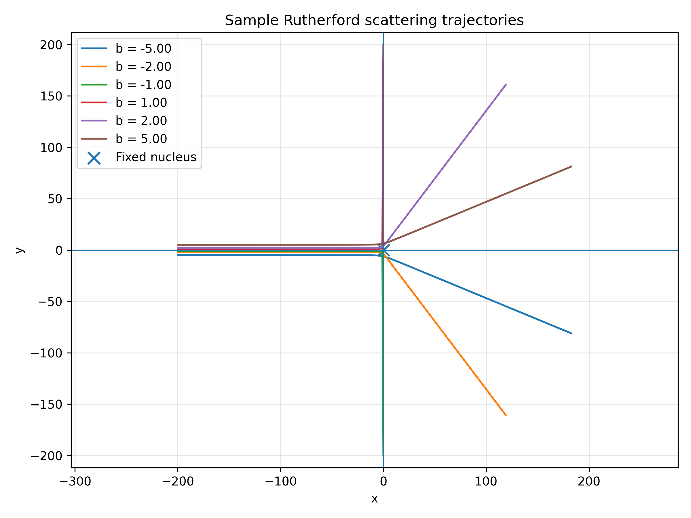
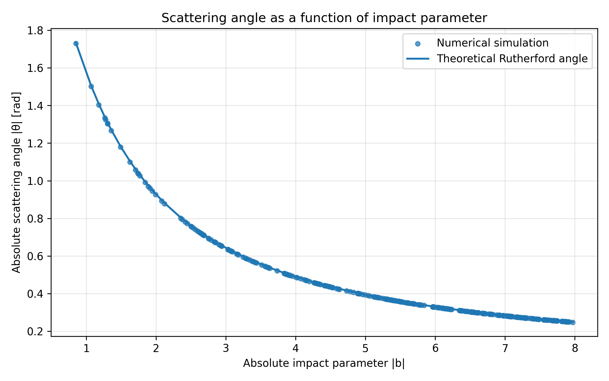
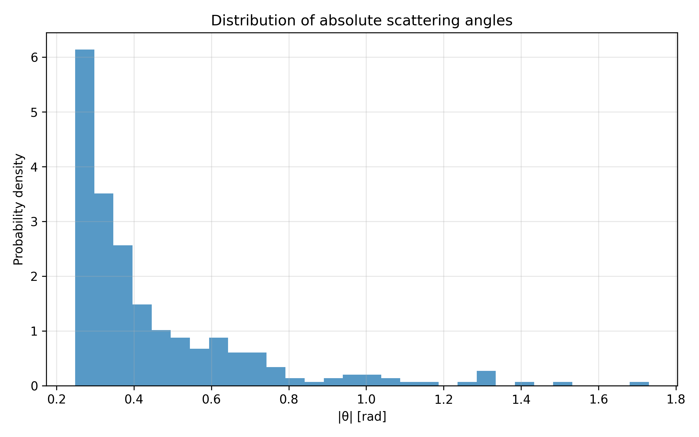
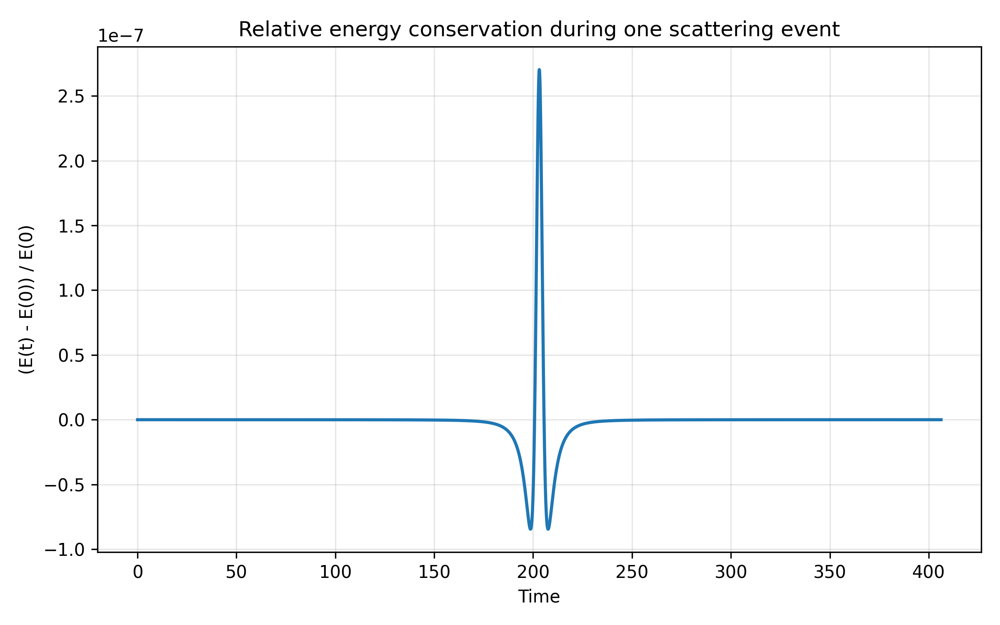
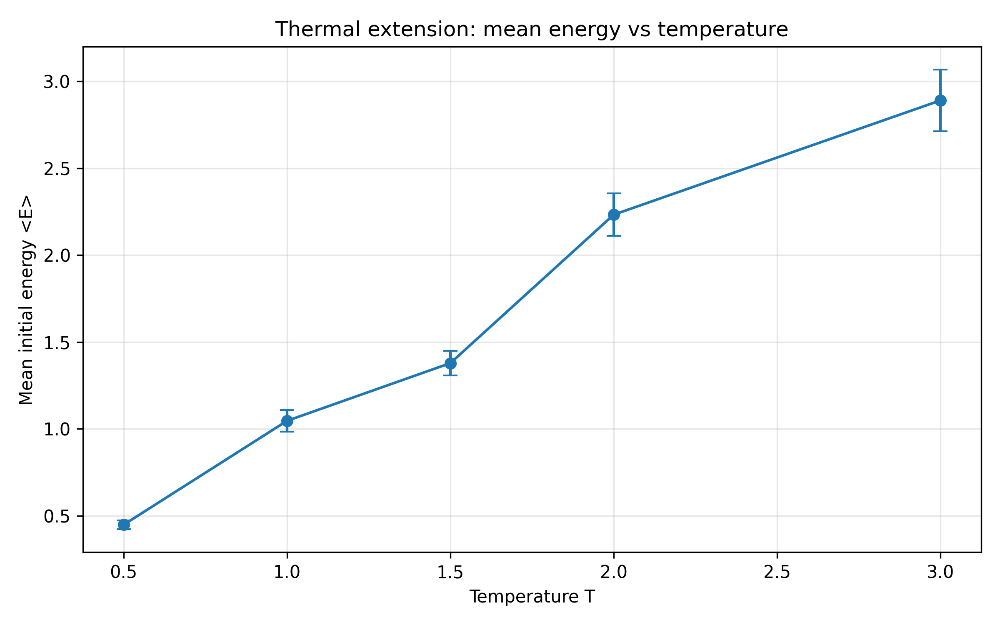
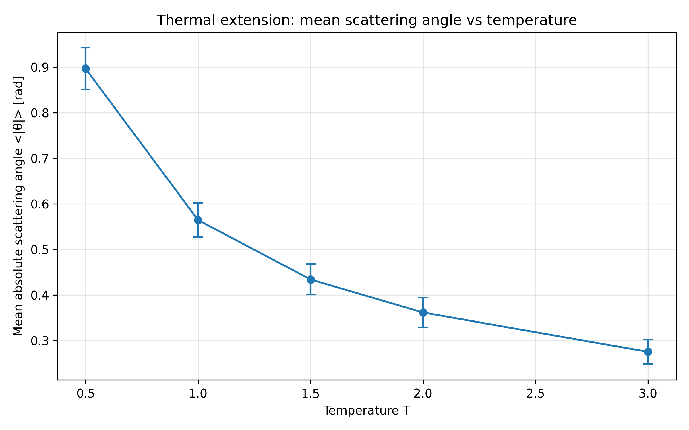

# Rutherford Scattering Monte Carlo Simulation

This repository contains a classical Monte Carlo simulation of Rutherford scattering. The project studies the scattering of charged particles by a fixed Coulomb center using randomly sampled impact parameters. The numerical results are compared with the theoretical Rutherford scattering relation.

The project was developed as a final project for the Statistical Mechanics course at Universidad de San Carlos de Guatemala.


## Project Overview

Rutherford scattering describes the deflection of charged particles due to the repulsive Coulomb interaction with a heavy nucleus. In this simulation, each incident particle starts far from the scattering center and moves initially along the positive x-axis. The impact parameter determines how close the particle passes to the nucleus and therefore how strongly it is deflected.

The central physical relation studied in this project is:

$$\theta(b) =
2\arctan\left(
\frac{kq_1q_2}{2Eb}
\right)$$

where:

- $b$ is the impact parameter,
- $E$ is the initial kinetic energy,
- $kq_1q_2$ is the Coulomb coupling,
- $\theta$ is the scattering angle.

The simulation uses Monte Carlo sampling to generate many impact parameters and obtain the corresponding statistical distribution of scattering angles.


## Main Objectives

The main goals of this project are:

1. To simulate classical Rutherford scattering using numerical integration.
2. To generate random impact parameters through a Monte Carlo method.
3. To compare numerical scattering angles with the theoretical Rutherford prediction.
4. To verify energy conservation during the numerical integration.
5. To study a thermal extension where the initial particle speed depends on temperature.


## Physical Model

The model assumes:

- Classical particles.
- A fixed scattering nucleus at the origin.
- Repulsive Coulomb interaction.
- Two-dimensional motion.
- No quantum effects.
- No energy loss or dissipative forces.
- Dimensionless units for numerical stability.

The equation of motion is:

$$
m\frac{d^2\mathbf{r}}{dt^2}
=
\frac{kq_1q_2}{r^3}\mathbf{r}.
$$

In the dimensionless implementation, the default values are:

$$
m = 1,
\qquad
kq_1q_2 = 1.
$$

This preserves the structure of the Rutherford scattering problem while avoiding unnecessary numerical stiffness.


## Numerical Method

The particle trajectories are integrated using the **Velocity Verlet method**, which is well suited for conservative mechanical systems because it provides good energy conservation.

For each particle:

1. An impact parameter $b$ is sampled randomly.
2. The particle starts at $x = -L$, $y = b$.
3. The initial velocity is directed along the positive x-axis.
4. The trajectory is integrated under the Coulomb force.
5. The final velocity is used to compute the numerical scattering angle.
6. The result is compared with the theoretical Rutherford angle.


## Monte Carlo Sampling

The impact parameters are sampled using two possible methods:

### Uniform sampling

$$
b \sim U(b_{\min}, b_{\max})
$$

### Area-based sampling

$$
b =
\sqrt{
u(b_{\max}^2-b_{\min}^2)+b_{\min}^2
},
\qquad
u \sim U(0,1)
$$

The area-based method is used as the default because it better represents particles uniformly distributed over a transverse area.

Positive and negative signs are assigned randomly to represent particles passing above or below the nucleus.


## Thermal Extension

In addition to the base Rutherford scattering simulation, the project includes a thermal extension.

For this extension, the initial speeds are sampled from a two-dimensional thermal distribution. In dimensionless units, $k_B = 1$ and $m = 1$, so the speed is sampled from a Rayleigh distribution with scale:

$$
\sqrt{T}
$$

This allows us to study:

$$
\langle E \rangle \text{ vs } T
$$

and

$$
\langle |\theta| \rangle \text{ vs } T.
$$

The expected physical behavior is:

$$
T \uparrow
\Rightarrow
\langle E \rangle \uparrow,
$$

and

$$
T \uparrow
\Rightarrow
\langle |\theta| \rangle \downarrow.
$$

Higher-energy particles are less strongly deflected by the Coulomb interaction.


## Repository Structure

```text
rutherford-scattering-monte-carlo/
│
├── README.md
├── requirements.txt
├── main.py
├── .gitignore
│
├── src/
│   ├── domain/
│   │   ├── constants.py
│   │   ├── models.py
│   │   └── physics.py
│   │
│   ├── simulation/
│   │   ├── integrator.py
│   │   ├── monte_carlo.py
│   │   └── experiment.py
│   │
│   ├── analysis/
│   │   ├── theoretical.py
│   │   └── statistics.py
│   │
│   ├── visualization/
│   │   ├── plots.py
│   │   └── trajectories.py
│   │
│   └── utils/
│       └── io.py
│
├── data/
│   ├── results.csv
│   ├── summary.json
│   └── thermal_extension.csv
│
├── figures/
│   ├── initial_configuration.png
│   ├── final_configuration.png
│   ├── sample_trajectories.png
│   ├── scattering_angle_vs_impact_parameter.png
│   ├── scattering_angle_histogram.png
│   ├── energy_conservation.png
│   ├── relative_energy_error.png
│   ├── mean_energy_vs_temperature.png
│   └── mean_scattering_angle_vs_temperature.png
│
├── tests/
│   ├── test_physics.py
│   ├── test_integrator.py
│   └── test_observables.py
│
└── report/
    ├── main.tex
    └── references.bib
```

## Installation

Clone the repository:

```bash
git clone https://github.com/ddudulce/rutherford-scattering-monte-carlo.git
cd rutherford-scattering-monte-carlo
```

Create a virtual environment:

```bash
python -m venv .venv
```

Activate the virtual environment.

On Windows PowerShell:

```powershell
.\.venv\Scripts\Activate.ps1
```

On Linux or macOS:

```bash
source .venv/bin/activate
```

Install the required dependencies:

```bash
pip install -r requirements.txt
```

---

## Dependencies

The main dependencies are:

```text
numpy
matplotlib
pandas
pytest
```

These are used for numerical calculations, plotting, data handling, and automated testing.

---

## How to Run the Simulation

To run the full simulation, execute:

```bash
python main.py
```

This will run:

1. The base Monte Carlo Rutherford scattering simulation.
2. The generation of initial and final configuration plots.
3. The generation of trajectory plots.
4. The comparison between numerical and theoretical scattering angles.
5. The energy conservation analysis.
6. The thermal extension.

The simulation produces output files inside the `data/` and `figures/` directories.

---

## Generated Data Files

The script generates:

```text
data/results.csv
data/summary.json
data/thermal_extension.csv
```

### `results.csv`

Contains the results for the base Monte Carlo simulation, including:

- particle ID,
- impact parameter,
- simulated scattering angle,
- theoretical scattering angle,
- initial energy,
- final energy,
- relative energy error,
- final position,
- final velocity.

### `summary.json`

Contains summary statistics, such as:

- number of particles,
- mean scattering angle,
- mean absolute scattering angle,
- RMS scattering angle,
- mean initial energy,
- mean final energy,
- maximum relative energy error.

### `thermal_extension.csv`

Contains the results of the thermal extension, including:

- temperature,
- mean initial energy,
- standard deviation of initial energy,
- mean absolute scattering angle,
- standard deviation of the absolute scattering angle,
- number of particles per temperature.

## Generated Figures

The simulation produces the following figures:

```text
figures/initial_configuration.png
figures/final_configuration.png
figures/sample_trajectories.png
figures/scattering_angle_vs_impact_parameter.png
figures/scattering_angle_histogram.png
figures/energy_conservation.png
figures/relative_energy_error.png
figures/mean_energy_vs_temperature.png
figures/mean_scattering_angle_vs_temperature.png
```

### Main figures

- **Initial configuration:** shows the incident particles before interacting with the nucleus.
- **Final configuration:** shows the particles after being scattered.
- **Sample trajectories:** shows representative Rutherford scattering trajectories.
- **Scattering angle vs impact parameter:** compares numerical and theoretical Rutherford scattering.
- **Scattering angle histogram:** shows the statistical angular distribution.
- **Energy conservation:** verifies that the numerical integration conserves mechanical energy.
- **Relative energy error:** shows the final relative energy error for the Monte Carlo ensemble.
- **Mean energy vs temperature:** verifies the thermal extension behavior.
- **Mean scattering angle vs temperature:** shows that higher-temperature particles are less deflected.

## Main Results

### Sample trajectories



### Scattering angle vs impact parameter



### Scattering angle distribution



### Energy conservation



### Thermal extension: mean energy vs temperature



### Thermal extension: mean scattering angle vs temperature



## Running Tests

To run all tests:

```bash
python -m pytest -q
```

The tests verify:

1. The Coulomb force points in the correct radial direction.
2. The Coulomb force follows the inverse-square law.
3. The acceleration is consistent with Newton's second law.
4. Kinetic, potential, and total energies are computed correctly.
5. The integrator conserves energy.
6. The scattering angle decreases as the impact parameter increases.
7. The numerical scattering angle agrees with the theoretical Rutherford prediction.


## Expected Physical Results

The simulation should reproduce the following physical trends:

### Impact parameter dependence

$$
|b| \uparrow
\Rightarrow
|\theta| \downarrow
$$

Particles with small impact parameters pass closer to the nucleus and are more strongly deflected.

### Energy conservation

$$
\frac{E(t)-E(0)}{E(0)} \approx 0$$


The total mechanical energy should remain nearly constant during the numerical integration.

### Thermal extension

$$
T \uparrow
\Rightarrow
\langle E\rangle \uparrow
$$

$$
T \uparrow
\Rightarrow
\langle |\theta|\rangle \downarrow
$$

Higher-temperature particles have larger mean kinetic energy and are therefore less strongly deflected.


## Authors

- Dulce Mayorga
- Josué Martínez


## Course Information

Final Project  
Statistical Mechanics  
Universidad de San Carlos de Guatemala  
Escuela de Ciencias Físicas y Matemáticas  
2026


## License

This project is intended for academic and educational purposes.